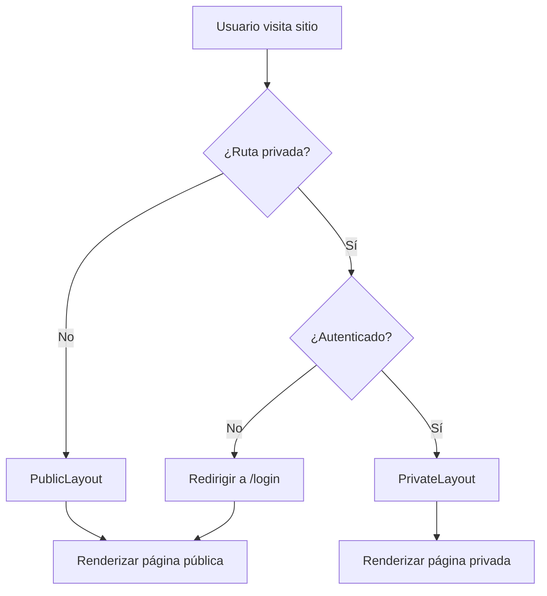

# To-Do List - Aplicación de Gestión de Tareas

Una aplicación simple y eficiente de to-do list desarrollada con React y Vite.

## 🔒 Nota de Seguridad Importante

Este proyecto utiliza **React 18.3.1** en lugar de React 19 debido a una vulnerabilidad crítica de seguridad:

> [!WARNING] > **CVE-2025-55182 (React2Shell)**
>
> Las versiones de React 19.0, 19.1.0, 19.1.1 y 19.2.0 contienen una vulnerabilidad crítica que permite ejecución remota de código (RCE) sin autenticación en aplicaciones con React Server Components. Por esta razón, hemos optado por usar React 18.3.1, que es una versión estable y segura.

## 📋 Stack Tecnológico

### Versiones Exactas

- **Node.js**: Compatible con 18.20.5+ (recomendado: 20.19+ o 24.x)
- **npm**: 10.x (incluido con Node.js)
- **React**: 18.3.1
- **React DOM**: 18.3.1
- **Vite**: 6.0.5
- **Tailwind CSS**: 4.1.18 con @tailwindcss/vite
- **React Router DOM**: 6.30.3
- **ESLint**: 8.57.1 con configuración Standard Style

### Bibliotecas de Gestión de Estado y UI

- **Zustand**: 5.0.10 (gestión de estado global)
- **React Hook Form**: 7.71.1 (manejo de formularios)
- **react-hot-toast**: 2.6.0 (sistema de notificaciones)
- **Axios**: 1.13.2 (cliente HTTP)

### Herramientas de Desarrollo

- **@vitejs/plugin-react**: 4.3.4
- **eslint-config-standard**: 17.1.0
- **eslint-plugin-import**: 2.32.0
- **eslint-plugin-n**: 17.23.1
- **eslint-plugin-promise**: 7.2.1
- **eslint-plugin-react**: 7.37.2
- **eslint-plugin-react-hooks**: 4.6.2
- **eslint-plugin-react-refresh**: 0.4.14

## 🚀 Prerrequisitos

Antes de comenzar, asegúrate de tener instalado:

- **Node.js** versión 18.20.5 o superior
- **npm** versión 10.x o superior

Verifica tus versiones instaladas con:

```bash
node --version
npm --version
```

## 📦 Instalación

Sigue estos pasos para configurar el proyecto en tu máquina local:

### 1. Clonar el repositorio

```bash
git clone <url-del-repositorio>
cd procrastinant-app
```

### 2. Instalar dependencias

```bash
npm install
```

Este comando instalará todas las dependencias necesarias especificadas en `package.json`.

### 3. Configuración de variables de entorno

Crea un archivo `.env` en la raíz del proyecto basándote en `.env.example`:

```bash
cp .env.example .env
```

Edita el archivo `.env` y configura la URL base de tu API:

```env
# API Configuration
VITE_API_BASE_URL=http://localhost:3000/api
```

> [!IMPORTANT]
> El archivo `.env` contiene configuración sensible y no debe ser commiteado a Git. Asegúrate de que esté en tu `.gitignore`.

## 📚 Bibliotecas Principales

### Tailwind CSS - Framework de Estilos

**Versión**: 4.1.18

Tailwind CSS se utiliza como framework principal de estilos con configuración personalizada.

**Configuración Custom**:

- **Paleta de Colores**: orange (#ea9010ff), green (#90be6dff), light (#eaefbdff), lightsecondary (#c9e3acff), dark (#37371fff)
- **Tipografías**: Mynerve-Regular (primary), CourierPrime-Regular (secondary)
- **Breakpoints**: tablet (768px), desktop (1024px)
- **Estilos Base**: border-radius (10px), box-shadow personalizado

**Ubicación**: `tailwind.config.js`

### Axios - Cliente HTTP

**Versión**: 1.13.2

Axios se utiliza para todas las comunicaciones con el backend. El proyecto incluye una configuración centralizada con interceptors.

**Características**:

- Instancia configurada con base URL desde variables de entorno
- Interceptors para agregar automáticamente token de autenticación
- Manejo centralizado de errores HTTP
- Integración con estados de carga globales

**Ubicación**: `src/config/axios.js`

**Ejemplo de uso**:

```javascript
import apiClient from '@/config/axios'

const fetchData = async () => {
  const response = await apiClient.get('/endpoint')
  return response.data
}
```

### Zustand - Gestión de Estado

**Versión**: 5.0.10

Zustand es la solución de gestión de estado global del proyecto. Se utilizan múltiples stores pequeños para mejor organización.

**Stores disponibles**:

1. **authStore** - Maneja autenticación y datos de usuario
   - Estado: `user`, `token`, `isAuthenticated`
   - Acciones: `login()`, `logout()`, `setUser()`, `checkAuth()`

2. **tareasStore** - Maneja la lista de tareas
   - Estado: `tareas`, `searchQuery`
   - Acciones: `setTareas()`, `addTarea()`, `updateTarea()`, `deleteTarea()`, `setSearchQuery()`, `getFilteredTareas()`
   - **Sin persistencia**: Los datos se obtienen del backend, no se guardan en localStorage

3. **uiStore** - Maneja estado de UI global
   - Estado: `isLoading`
   - Acciones: `setIsLoading()`
   - **Nota**: Las notificaciones se manejan con `react-hot-toast` (ver sección abajo)

**Ubicación**: `src/stores/`

**Ejemplo de uso**:

```javascript
import {useAuthStore} from '@/stores/authStore'

function MyComponent() {
  const {user, isAuthenticated, login} = useAuthStore()

  // Usar el estado y acciones...
}
```

### react-hot-toast - Sistema de Notificaciones

**Versión**: 2.6.0

react-hot-toast proporciona notificaciones toast elegantes y personalizables.

**Configuración global** (en `App.jsx`):

- Posición: top-center
- Duración: 3000ms
- Estilos personalizados con variables CSS del proyecto
- Iconos personalizados para success/error

**Ubicación**: Configurado en `src/App.jsx`

**Ejemplo de uso**:

```javascript
import toast from 'react-hot-toast'

// Mostrar notificaciones
toast.success('¡Operación exitosa!')
toast.error('Ocurrió un error')
toast.loading('Cargando...')
```

### React Hook Form - Manejo de Formularios

**Versión**: 7.71.1

React Hook Form se utiliza para todos los formularios de la aplicación con validación nativa.

**Características**:

- Validación nativa (sin bibliotecas externas)
- Mensajes de error en español
- Patrones de validación predefinidos
- Integración con custom hooks del proyecto

**Templates de formularios disponibles**:

- `LoginForm.jsx` - Formulario de inicio de sesión
- `RegisterForm.jsx` - Formulario de registro
- `TareaForm.jsx` - Formulario para crear/editar tareas
- `ProfileForm.jsx` - Formulario de perfil de usuario
- `PasswordForm.jsx` - Formulario de cambio de contraseña

**Ubicación**: `src/features/[feature]/forms/`

**Ejemplo de uso**:

```javascript
import {useForm} from 'react-hook-form'
import {VALIDATION_MESSAGES, VALIDATION_PATTERNS} from '@/config/constants'

function MyForm() {
  const {
    register,
    handleSubmit,
    formState: {errors},
  } = useForm()

  const onSubmit = (data) => {
    console.log(data)
  }

  return (
    <form onSubmit={handleSubmit(onSubmit)}>
      <input
        {...register('email', {
          required: VALIDATION_MESSAGES.required,
          pattern: {
            value: VALIDATION_PATTERNS.EMAIL,
            message: VALIDATION_MESSAGES.email,
          },
        })}
      />
      {errors.email && <span>{errors.email.message}</span>}
    </form>
  )
}
```

## 🪝 Custom Hooks

El proyecto incluye custom hooks para simplificar el uso de las bibliotecas principales:

### useAuth

Hook para manejar autenticación:

```javascript
import {useAuth} from '@/hooks/useAuth'

const {user, isAuthenticated, login, register, logout} = useAuth()
```

### useToast

Hook para mostrar notificaciones toast:

```javascript
import {useToast} from '@/hooks/useToast'

const {showSuccess, showError, showInfo, showWarning} = useToast()

// Usar
showSuccess('¡Operación exitosa!')
showError('Ocurrió un error')
```

### useApi

Hook wrapper de Axios con estados locales:

```javascript
import {useApi} from '@/hooks/useApi'
import * as service from '@/services/myService'

const {data, error, isLoading, execute} = useApi()

const handleAction = async () => {
  await execute(service.myFunction, arg1, arg2)
}
```

### useSpeechRecognition

Hook para reconocimiento de voz usando Web Speech API:

```javascript
import useSpeechRecognition from '@/hooks/useSpeechRecognition'

const {
  isListening,
  isSupported,
  transcript,
  error,
  startListening,
  stopListening,
  resetTranscript,
} = useSpeechRecognition()

// Iniciar escucha
startListening()

// El texto reconocido estará en 'transcript'
console.log(transcript)

// Detener
stopListening()
```

**Características**:

- Reconocimiento de voz en español (es-ES)
- Detección automática de soporte del navegador
- Timeout de silencio configurable (2000ms)
- Manejo de errores con mensajes localizados
- Estados: `isListening`, `isSupported`, `transcript`, `error`

## 🔧 Configuración y Constantes

### Constants (`src/config/constants.js`)

Define constantes globales del proyecto:

- **TOAST_DURATION**: Duración de notificaciones (3000ms)
- **TASK_COMPLETION_DELAY**: Delay para completar tareas (5000ms)
- **VALIDATION_MESSAGES**: Mensajes de validación en español
- **TOAST_TYPES**: Tipos de toast disponibles (success, error, info, warning)
- **API_ENDPOINTS**: Endpoints de la API REST (auth, tareas, user, health)
- **VALIDATION_PATTERNS**: Expresiones regulares para validación (email, password, etc.)
- **SPEECH_RECOGNITION_CONFIG**: Configuración del reconocimiento de voz (idioma, timeouts, etc.)
- **SPEECH_RECOGNITION_MESSAGES**: Mensajes de error del reconocimiento de voz localizados

## 🛠️ Scripts Disponibles

En el directorio del proyecto, puedes ejecutar los siguientes comandos:

### `npm run dev`

Inicia el servidor de desarrollo de Vite.

- La aplicación se abrirá automáticamente en [http://localhost:5173](http://localhost:5173)
- Los cambios se reflejarán automáticamente con Hot Module Replacement (HMR)

```bash
npm run dev
```

### `npm run build`

Compila la aplicación para producción en la carpeta `dist`.

- Optimiza el código para mejor rendimiento
- Los archivos están minificados y listos para despliegue

```bash
npm run build
```

### `npm run preview`

Previsualiza la aplicación compilada localmente.

- Útil para probar el build de producción antes de desplegarlo
- Ejecuta este comando después de `npm run build`

```bash
npm run preview
```

### `npm run lint`

Ejecuta ESLint para analizar el código y detectar problemas.

- Verifica el código contra las reglas de Standard Style
- No permite advertencias (--max-warnings 0)

```bash
npm run lint
```

> [!TIP]
> Para corregir automáticamente problemas de formato, ejecuta:
>
> ```bash
> npx eslint 'src/**/*.{js,jsx}' --fix
> ```

## 🧪 Testing

Este proyecto cuenta con una suite completa de tests unitarios que cubren la lógica de negocio crítica.

### Suite de Tests Implementada

**✅ 185 tests totales - 90% passing (167/185)**

| Módulo       | Tests | Estado  | Coverage |
| ------------ | ----- | ------- | -------- |
| **Stores**   | 49    | ✅ 100% | 88-100%  |
| **Services** | 60    | ✅ 100% | 100%     |
| **Hooks**    | 67    | ⚠️ 89%  | 85%+     |

**Stores incluidos:**

- `tareasStore` (27 tests): CRUD, filtrado, async operations, persistencia
- `uiStore` (22 tests): Loading, toasts, modals

**Services incluidos:**

- `authService` (16 tests): Login, register, logout, verifyAuth
- `tareasService` (24 tests): CRUD completo de tareas
- `userService` (20 tests): Perfil, password, delete account

**Hooks incluidos:**

- `useAuth` (13 tests): Integración con authStore y authService
- `useApi` (15 tests): Execute, reset, error handling
- `useToast` (16 tests): Toast types, timers, cleanup
- `useFormPersistence` (12 tests): localStorage persistence, TTL
- `useSpeechRecognition` (11 tests): Browser support, start/stop, errors

### Ejecutar Tests

```bash
# Ejecutar todos los tests
npm run test

# Tests en modo watch (útil durante desarrollo)
npm run test:watch

# Ver reporte de cobertura
npm run test:coverage

# Interfaz interactiva (recomendado)
npm run test:ui
```

### Coverage Configurado

El proyecto tiene umbrales mínimos de cobertura configurados:

- **Lines**: 70%
- **Functions**: 70%
- **Branches**: 60%
- **Statements**: 70%

> [!NOTE]
> Ver el reporte HTML de coverage: después de `npm run test:coverage`, abre `coverage/index.html` en tu navegador.

## 🐛 Depuración y Testing

### Ejecutar Tests

El proyecto cuenta con una suite completa de tests unitarios e integración usando Vitest y React Testing Library.

**Tests Unitarios:**

```bash
npm run test
```

**Tests en modo watch (desarrollo):**

```bash
npm run test:watch
```

**Reporte de cobertura:**

```bash
npm run test:coverage
```

**UI interactiva de Vitest:**

```bash
npm run test:ui
```

> [!NOTE]
> Después de ejecutar `npm run test:coverage`, puedes ver el reporte detallado abriendo `coverage/index.html` en tu navegador.

### Coverage MínREQUERIDO

El proyecto tiene configurados umbrales mínimos de cobertura:

- **Líneas**: 70%
- **Funciones**: 70%
- **Branches**: 60%
- **Statements**: 70%

Si la cobertura está por debajo de estos valores, el comando `npm run test:coverage` fallará.

---

### Estrategias de Debugging

#### React DevTools

La mejor herramienta para depurar componentes React:

1. **Instalar la extensión**: [React DevTools](https://react.dev/learn/react-developer-tools)
2. **Abrir DevTools** (F12) → pestaña "Components" o "Profiler"
3. **Inspeccionar componentes**: Ver props, state, hooks en tiempo real
4. **Profiling**: Identificar componentes que renderizan innecesariamente

**Ejemplo de uso:**

- Click en un componente en el árbol
- Ver sus props y state actual
- Buscar componentes con el ícono de búsqueda

#### Debugging de Stores (Zustand)

Para inspeccionar el estado de Zustand desde cualquier parte de la aplicación:

```javascript
// En cualquier componente o consola del navegador
import {useAuthStore} from '@/stores/authStore'

// Ver estado actual
const state = useAuthStore.getState()
console.log('Estado de autenticación:', state)

// Suscribirse a cambios
useAuthStore.subscribe((state) => {
  console.log('Store actualizado:', state)
})
```

**Desde la consola del navegador:**

```javascript
// Acceder directamente al store (solo para debugging)
window.__ZUSTAND_STORES__ // Si lo configuras
```

#### Debugging de Axios y API

Los interceptors en `src/config/axios.js` ya loguean automáticamente todos los errores HTTP.

**Para debugging adicional**, puedes agregar temporalmente:

```javascript
apiClient.interceptors.request.use((config) => {
  console.log('📤 Request:', config.method?.toUpperCase(), config.url)
  console.log('📦 Data:', config.data)
  return config
})

apiClient.interceptors.response.use((response) => {
  console.log('📥 Response:', response.status, response.data)
  return response
})
```

#### Breakpoints en Chrome DevTools

El método más efectivo para debugging detallado:

1. **Abrir DevTools** (F12)
2. **Ir a Sources**
3. **Buscar archivo** (Ctrl+P / Cmd+P)
4. **Click en número de línea** para agregar breakpoint
5. **Ejecutar la acción** que quieres debuggear
6. La ejecución se pausará en el breakpoint

**Funcionalidades útiles:**

- **Step Over** (F10): Siguiente línea
- **Step Into** (F11): Entrar en función
- **Step Out** (Shift+F11): Salir de función
- **Console**: Evaluar expresiones en el contexto actual

#### Source Maps

Los source maps están habilitados en desarrollo, permitiendo ver el código original en DevTools en lugar del code transpilado.

---

### Problemas Comunes y Soluciones

#### Error: CORS

**Síntomas:** "Access to XMLHttpRequest at '...' from origin '...' has been blocked by CORS policy"

**Causas:**

- Backend no tiene headers CORS configurados
- Credenciales (`withCredentials: true`) no match con backend

**Solución:**

1. Verificar que el backend tenga:
   ```javascript
   // Backend (Express ejemplo)
   app.use(
     cors({
       origin: 'http://localhost:5173',
       credentials: true,
     }),
   )
   ```
2. En `src/config/axios.js`, verificar: `withCredentials: true`

---

#### Sesión Expirada Inesperadamente

**Síntomas:** Usuario es deslogueado sin razón aparente

**Debugging:**

1. Verificar token en localStorage:
   ```javascript
   // En consola del navegador
   localStorage.getItem('auth-storage')
   ```
2. Revisar interceptor 401 en `src/config/axios.js`
3. Verificar que el backend no esté expirando tokens prematuramente
4. Comprobar Network tab: buscar responses 401

---

#### Componente No Re-renderiza

**Síntomas:** El estado actualiza pero la UI no se refleja

**Causas comunes:**

- Dependencias faltantes en `useEffect`
- Store de Zustand no está suscribiéndose correctamente
- Mutación directa de estado (en lugar de inmutabilidad)

**Debugging:**

1. **React DevTools Profiler**: Ver qué componentes renderizan
2. **Verificar dependencias de useEffect:**
   ```javascript
   useEffect(() => {
     // ...
   }, [dep1, dep2]) // ¿Faltan dependencias?
   ```
3. **Zustand debugging:**
   ```javascript
   const todos = useTareasStore((state) => state.tareas)
   console.log('Tareas actuales:', todos)
   ```
4. **Verificar inmutabilidad:**

   ```javascript
   // ❌ Mal (mutación directa)
   state.tareas.push(newTarea)

   // ✅ Bien (nuevo array)
   state.tareas = [...state.tareas, newTarea]
   ```

---

#### Error: "Cannot read property 'X' of undefined"

**Causas:**

- Datos aún no cargados (async)
- Propiedades opcionales sin optional chaining

**Solución:**

```javascript
// ❌ Mal
const userName = user.nombre

// ✅ Bien (con optional chaining)
const userName = user?.nombre

// ✅ Bien (con default)
const userName = user?.nombre || 'Anónimo'
```

---

#### Performance: Renders Excesivos

**Debugging:**

1. **React DevTools Profiler**:
   - Grabar una interacción
   - Ver qué componentes renderizan y por qué
   - Buscar renders innecesarios

2. **Memo aizar selectores de Zustand:**

   ```javascript
   // ❌ Mal (crea nuevo objeto cada vez)
   const {tareas, searchQuery} = useTareasStore()

   // ✅ Bien (solo re-renderiza si cambia)
   const tareas = useTareasStore((state) => state.tareas)
   ```

3. **React.memo para componentes:**
   ```javascript
   const TareaItem = React.memo(({tarea}) => {
     // ...
   })
   ```

---

#### Error Boundary

El proyecto incluye un componente `ErrorBoundary` que captura errores de render en producción.

**Para probar:**

```javascript
// En cualquier componente, forzar error
throw new Error('Error de prueba')
```

El ErrorBoundary mostrará una UI amigable con opción de reset.

---

### Logs Estructurados

Los interceptors de Axios ya proveen logging automático de errores con información estructurada:

- **Status code**: 401, 403, 404, 429, 500
- **Mensaje**: Del backend o genérico
- **Contexto**: URL del endpoint

**En desarrollo**, todos los console.error se muestran en consola.

**Para producción**, considera integrar con [Sentry](https://sentry.io) (ver comentarios en `ErrorBoundary.jsx`).

---

### Tips Adicionales

1. **Use Strict Mode**: Ya está habilitado en el proyecto (`React.StrictMode` en `main.jsx`)
2. **Console Groups**: Organiza logs relacionados
   ```javascript
   console.group('🔧 Debugging Tarea')
   console.log('Tarea:', tarea)
   console.log('Estado:', isComplete)
   console.groupEnd()
   ```
3. **Label your console.logs**:
   ```javascript
   console.log('[TareaForm] Submitting:', data)
   ```
4. **Network Tab**: Siempre revisa la tab Network para ver requests/responses reales

## 📁 Estructura del Proyecto

```
procrastinant-app/
├── node_modules/          # Dependencias instaladas
├── public/                # Archivos estáticos públicos
├── dist/                  # Build de producción (generado)
├── src/                   # Código fuente de la aplicación
│   ├── features/          # Features organizadas por funcionalidad
│   │   ├── autenticacion/
│   │   │   ├── components/
│   │   │   ├── services/
│   │   │   └── index.js
│   │   ├── dashboard/
│   │   │   ├── components/
│   │   │   ├── services/
│   │   │   └── index.js
│   │   └── configuracion-usuario/
│   │       ├── components/
│   │       ├── services/
│   │       └── index.js
│   ├── layouts/           # Layouts compartidos
│   │   ├── PublicLayout.jsx
│   │   └── PrivateLayout.jsx
│   ├── shared/            # Componentes compartidos
│   │   └── components/
│   │       ├── layout/    # Componentes de layout (Footer, Navbar, etc.)
│   │       └── ...        # Otros componentes compartidos
│   ├── routes/            # Sistema de rutas
│   │   ├── AppRoutes.jsx
│   │   ├── ProtectedRoute.jsx
│   │   └── index.js
│   ├── pages/             # Páginas independientes
│   │   ├── Inicio.jsx
│   │   └── PaginaError.jsx
│   ├── stores/            # Stores de Zustand
│   │   ├── authStore.js
│   │   ├── tareasStore.js
│   │   ├── uiStore.js
│   │   └── __tests__/
│   ├── hooks/             # Custom hooks
│   │   ├── useAuth.js
│   │   ├── useApi.js
│   │   ├── useToast.js
│   │   ├── useSpeechRecognition.js
│   │   └── __tests__/
│   ├── services/          # Servicios de API
│   │   └── mappers/       # Transformadores de datos
│   ├── config/            # Configuración
│   │   ├── axios.js       # Configuración de Axios
│   │   ├── constants.js   # Constantes globales
│   │   └── env.js         # Variables de entorno
│   ├── assets/            # Recursos estáticos
│   │   ├── fonts/         # Fuentes personalizadas
│   │   ├── icons/         # Iconos (SVG, PNG)
│   │   └── images/        # Imágenes
│   ├── utils/             # Utilidades generales
│   ├── test/              # Configuración de tests
│   ├── App.jsx            # Componente principal
│   ├── main.jsx           # Punto de entrada de la aplicación
│   └── index.css          # Estilos globales con Tailwind
├── .env                   # Variables de entorno (no versionado)
├── .env.example           # Ejemplo de variables de entorno
├── .eslintrc.cjs          # Configuración de ESLint (Standard Style)
├── .gitignore             # Archivos ignorados por Git
├── index.html             # Plantilla HTML principal con meta tags SEO
├── package.json           # Dependencias y scripts del proyecto
├── tailwind.config.js     # Configuración de Tailwind CSS
├── vite.config.js         # Configuración de Vite
├── jsconfig.json          # Configuración de JavaScript (alias @)
├── vercel.json            # Configuración de despliegue en Vercel
└── README.md              # Este archivo
```

### Descripción de Carpetas Principales

- **`public/`**: Contiene recursos estáticos que se copian directamente al build final.
- **`src/`**: Todo el código fuente de React. Aquí es donde desarrollarás la aplicación.
- **`node_modules/`**: Contiene todas las dependencias instaladas (no se versiona en Git).

## 🏗️ Arquitectura del Proyecto

Este proyecto utiliza una **arquitectura basada en features** (feature-based architecture) que organiza el código por funcionalidad en lugar de por tipo de archivo. Esta estructura facilita la escalabilidad y el mantenimiento.

### Patrón de Features

Cada feature es una funcionalidad principal autocontenida con su propia estructura interna:

```
features/[nombre-feature]/
├── components/       # Componentes específicos de la feature
├── hooks/           # Hooks personalizados de la feature
├── utils/           # Utilidades y helpers
├── constants/       # Constantes específicas
└── index.js         # Barrel export para exportaciones centralizadas
```

#### Features del Proyecto

1. **autenticacion** - Maneja login, registro y recuperación de contraseña
   - `PaginaLogin.jsx`
   - `PaginaRegistro.jsx`
   - `PaginaRecuperacion.jsx`

2. **dashboard** - Panel principal de tareas del usuario
   - `PaginaDashboard.jsx`

3. **configuracion-usuario** - Configuración y preferencias del usuario
   - `PaginaConfiguracion.jsx`

### Sistema de Layouts

Los layouts proporcionan estructura común compartida entre páginas:

#### PublicLayout

- **Usado en**: Inicio, Login, Registro, Recuperar Contraseña, Error Page
- **Contiene**: Footer
- **Características**: Interfaz mínima para usuarios no autenticados

#### PrivateLayout

- **Usado en**: Dashboard, Configuración
- **Contiene**: Navegación principal + Footer
- **Características**: Interfaz completa para usuarios autenticados

### Mapa de Rutas

#### Rutas Públicas (sin autenticación requerida)

| Ruta                    | Componente         | Descripción                 |
| ----------------------- | ------------------ | --------------------------- |
| `/`                     | Inicio             | Landing page/home           |
| `/login`                | PaginaLogin        | Inicio de sesión            |
| `/registro`             | PaginaRegistro     | Registro de nuevos usuarios |
| `/recuperar-contrasena` | PaginaRecuperacion | Recuperación de contraseña  |
| `/error`                | PaginaError        | Página de error/404         |

#### Rutas Privadas (requieren autenticación)

| Ruta             | Componente          | Descripción               |
| ---------------- | ------------------- | ------------------------- |
| `/dashboard`     | PaginaDashboard     | Panel principal de tareas |
| `/configuracion` | PaginaConfiguracion | Configuración de usuario  |

> [!NOTE]
> Las rutas privadas están protegidas por el componente `ProtectedRoute`, que redirige a `/login` si el usuario no está autenticado.

### Componentes Compartidos

Ubicados en `src/shared/components/`, estos son componentes reutilizables en toda la aplicación:

- **Navegacion** - Sistema de navegación (navbar/header)
- **Footer** - Pie de página común
- **Modal** - Componente modal genérico
- **BotonSimple** - Botón sin iconos
- **BotonConIcono** - Botón con soporte para iconos

Todos los componentes compartidos son **presentacionales** (stateless) y reciben sus datos a través de props.

### Sistema de Rutas

El proyecto utiliza **React Router v6** para la navegación:

- **BrowserRouter**: Configurado en `App.jsx`
- **AppRoutes**: Define todas las rutas en `src/routes/AppRoutes.jsx`
- **ProtectedRoute**: Protege rutas privadas en `src/routes/ProtectedRoute.jsx`

#### Flujo de Navegación


```mermaid
graph TD
    A[Usuario visita sitio] --> B{¿Ruta privada?}
    B -->|No| C[PublicLayout]
    B -->|Sí| D{¿Autenticado?}
    D -->|No| E[Redirigir a /login]
    D -->|Sí| F[PrivateLayout]
    C --> G[Renderizar página pública]
    F --> H[Renderizar página privada]
    E --> G
```

### Convenciones de Nomenclatura

- **Carpetas**: kebab-case en español (`autenticacion`, `configuracion-usuario`)
- **Componentes**: PascalCase en español (`PaginaLogin`, `BotonSimple`)
- **Archivos de componentes**: `.jsx` extension
- **Exports centralizados**: `index.js` en cada feature para barrel exports

## ⚙️ Configuración de ESLint

El proyecto está configurado con:

- **Standard Style**: Base de reglas de estilo de código JavaScript
- **Plugins para React**: Verificación de mejores prácticas en React
- **React Hooks**: Reglas para el uso correcto de Hooks
- **React Refresh**: Soporte para Fast Refresh en desarrollo

Principales reglas personalizadas:

- Longitud máxima de línea: 100 caracteres
- Indentación: 2 espacios
- Comillas: simples (single quotes)
- Semicolons: sin semicolons al final de líneas (Standard style)
- React en JSX scope desactivado (no necesario en React 17+)

### Reglas de Standard Style

Standard Style es una guía de estilo de JavaScript que **no requiere configuración**:

- ✅ Sin semicolons (excepto cuando son necesarios)
- ✅ Comillas simples para strings
- ✅ Indentación de 2 espacios
- ✅ Sin espacios internos en llaves de objetos: `{foo: 'bar'}` no `{ foo: 'bar' }`
- ✅ Trailing commas en objetos y arrays multilínea

Para más información: [standardjs.com](https://standardjs.com/)

## � Configuración SEO

El proyecto incluye una configuración completa de SEO en el archivo `index.html`:

### Meta Tags Implementados

**Meta Tags Básicos**:

- `charset`: UTF-8
- `viewport`: Responsive design
- `description`: Descripción de la aplicación para motores de búsqueda
- `keywords`: Palabras clave relevantes (productividad, tareas, procrastinación, etc.)
- `author`: MCeciliaLuna-dev

**Open Graph (Facebook, LinkedIn)**:

- `og:type`: website
- `og:title`: Procrastinant - Vence la procrastinación
- `og:description`: Descripción detallada de la aplicación
- `og:image`: Logo de la aplicación

**Twitter Cards**:

- `twitter:card`: summary_large_image
- `twitter:title`: Procrastinant
- `twitter:description`: Descripción para compartir en Twitter

**Otros**:

- `theme-color`: #FF6B35 (color personalizado para navegadores móviles)
- `favicon`: Logo personalizado en formato PNG

### Mejores Prácticas SEO

✅ Títulos descriptivos en cada página
✅ Meta descriptions únicas
✅ Estructura semántica HTML5
✅ Atributos alt en imágenes
✅ URLs amigables con React Router
✅ Performance optimizado con Vite

## �🔄 Flujo de Trabajo Recomendado

1. **Desarrollo**: Ejecuta `npm run dev` para iniciar el servidor de desarrollo
2. **Linting**: Ejecuta `npm run lint` para verificar problemas de código
3. **Build**: Ejecuta `npm run build` para compilar la versión de producción
4. **Previsualización**: Ejecuta `npm run preview` para probar el build local

## 📝 Próximos Pasos

Esta es solo la **Etapa 1: Configuración del Entorno de Desarrollo**. Las siguientes etapas incluirán:

- **Arquitectura de componentes**: Diseño de la estructura de componentes React
- **Diseño UI/UX**: Implementación de la interfaz de usuario
- **Funcionalidad de to-do list**: Agregar, editar, eliminar y marcar tareas
- **Estado global**: Gestión de estado con Context API o Redux
- **Persistencia**: Guardar tareas en localStorage o backend
- **Testing**: Pruebas unitarias e integración

## 👥 Editores Recomendados

- **VS Code**: Se recomienda instalar las extensiones:
  - ESLint
  - ES7+ React/Redux/React-Native snippets

- **Antigravity de Google**: Compatible con configuración estándar

## 🐛 Solución de Problemas

### El servidor no inicia

Verifica que estés usando una versión compatible de Node.js:

```bash
node --version
```

### Errores de ESLint

Ejecuta `npm run format` primero para corregir problemas de formateo automáticamente.

### Puerto en uso

Si el puerto 5173 está ocupado, Vite intentará usar el siguiente puerto disponible automáticamente.

## 📄 Licencia

Este proyecto es de código abierto y está disponible bajo la licencia MIT.

---

**Desarrollado con ❤️ usando React y Vite**
