# To-Do List - Aplicación de Gestión de Tareas

Una aplicación simple y eficiente de to-do list desarrollada con React y Vite.

## 🔒 Nota de Seguridad Importante

Este proyecto utiliza **React 18.3.1** en lugar de React 19 debido a una vulnerabilidad crítica de seguridad:

> [!WARNING]
> **CVE-2025-55182 (React2Shell)**
>
> Las versiones de React 19.0, 19.1.0, 19.1.1 y 19.2.0 contienen una vulnerabilidad crítica que permite ejecución remota de código (RCE) sin autenticación en aplicaciones con React Server Components. Por esta razón, hemos optado por usar React 18.3.1, que es una versión estable y segura.

## 📋 Stack Tecnológico

### Versiones Exactas

- **Node.js**: Compatible con 18.20.5+ (recomendado: 20.19+ o 24.x)
- **npm**: 10.x (incluido con Node.js)
- **React**: 18.3.1
- **React DOM**: 18.3.1
- **Vite**: 6.0.5
- **ESLint**: 8.57.1 con configuración Google Style

### Herramientas de Desarrollo

- **@vitejs/plugin-react**: 4.3.4
- **eslint-config-google**: 0.14.0
- **eslint-plugin-react**: 7.37.2
- **eslint-plugin-react-hooks**: 4.6.2
- **eslint-plugin-react-refresh**: 0.4.14

## 🚀 Prerrequisitos

Antes de comenzar, asegúrate de tener instalado:

- **Node.js** versión 18.20.5 o superior
- **npm** versión 10.x o superior

Verifica tus versiones instaladas con:

```bash
node --version
npm --version
```

## 📦 Instalación

Sigue estos pasos para configurar el proyecto en tu máquina local:

### 1. Clonar el repositorio

```bash
git clone <url-del-repositorio>
cd procrastinant-app
```

### 2. Instalar dependencias

```bash
npm install
```

Este comando instalará todas las dependencias necesarias especificadas en `package.json`.

### 3. Configuración de variables de entorno (opcional)

Actualmente el proyecto no requiere variables de entorno adicionales.

## 🛠️ Scripts Disponibles

En el directorio del proyecto, puedes ejecutar los siguientes comandos:

### `npm run dev`

Inicia el servidor de desarrollo de Vite.

- La aplicación se abrirá automáticamente en [http://localhost:5173](http://localhost:5173)
- Los cambios se reflejarán automáticamente con Hot Module Replacement (HMR)

```bash
npm run dev
```

### `npm run build`

Compila la aplicación para producción en la carpeta `dist`.

- Optimiza el código para mejor rendimiento
- Los archivos están minificados y listos para despliegue

```bash
npm run build
```

### `npm run preview`

Previsualiza la aplicación compilada localmente.

- Útil para probar el build de producción antes de desplegarlo
- Ejecuta este comando después de `npm run build`

```bash
npm run preview
```

### `npm run lint`

Ejecuta ESLint para analizar el código y detectar problemas.

- Verifica el código contra las reglas de Google Style Guide
- No permite advertencias (--max-warnings 0)

```bash
npm run lint
```

## 📁 Estructura del Proyecto

```
procrastinant-app/
├── node_modules/          # Dependencias instaladas
├── public/                # Archivos estáticos públicos
├── src/                   # Código fuente de la aplicación
│   ├── features/          # Features organizadas por funcionalidad
│   │   ├── autenticacion/
│   │   ├── dashboard/
│   │   └── configuracion-usuario/
│   ├── layouts/           # Layouts compartidos
│   │   ├── PublicLayout.jsx
│   │   └── PrivateLayout.jsx
│   ├── shared/            # Componentes compartidos
│   │   └── components/
│   ├── routes/            # Sistema de rutas
│   │   ├── AppRoutes.jsx
│   │   ├── ProtectedRoute.jsx
│   │   └── index.js
│   ├── pages/             # Páginas independientes
│   ├── assets/            # Recursos estáticos
│   ├── App.jsx            # Componente principal
│   ├── main.jsx           # Punto de entrada de la aplicación
│   └── index.css          # Estilos globales
├── .eslintrc.cjs          # Configuración de ESLint (Google Style)
├── .gitignore             # Archivos ignorados por Git
├── index.html             # Plantilla HTML principal
├── package.json           # Dependencias y scripts del proyecto
├── vite.config.js         # Configuración de Vite
└── README.md              # Este archivo
```

### Descripción de Carpetas Principales

- **`public/`**: Contiene recursos estáticos que se copian directamente al build final.
- **`src/`**: Todo el código fuente de React. Aquí es donde desarrollarás la aplicación.
- **`node_modules/`**: Contiene todas las dependencias instaladas (no se versiona en Git).

## 🏗️ Arquitectura del Proyecto

Este proyecto utiliza una **arquitectura basada en features** (feature-based architecture) que organiza el código por funcionalidad en lugar de por tipo de archivo. Esta estructura facilita la escalabilidad y el mantenimiento.

### Patrón de Features

Cada feature es una funcionalidad principal autocontenida con su propia estructura interna:

```
features/[nombre-feature]/
├── components/       # Componentes específicos de la feature
├── hooks/           # Hooks personalizados de la feature
├── utils/           # Utilidades y helpers
├── constants/       # Constantes específicas
└── index.js         # Barrel export para exportaciones centralizadas
```

#### Features del Proyecto

1. **autenticacion** - Maneja login, registro y recuperación de contraseña
   - `PaginaLogin.jsx`
   - `PaginaRegistro.jsx`
   - `PaginaRecuperacion.jsx`

2. **dashboard** - Panel principal de tareas del usuario
   - `PaginaDashboard.jsx`

3. **configuracion-usuario** - Configuración y preferencias del usuario
   - `PaginaConfiguracion.jsx`

### Sistema de Layouts

Los layouts proporcionan estructura común compartida entre páginas:

#### PublicLayout

- **Usado en**: Inicio, Login, Registro, Recuperar Contraseña, Error Page
- **Contiene**: Footer
- **Características**: Interfaz mínima para usuarios no autenticados

#### PrivateLayout

- **Usado en**: Dashboard, Configuración
- **Contiene**: Navegación principal + Footer
- **Características**: Interfaz completa para usuarios autenticados

### Mapa de Rutas

#### Rutas Públicas (sin autenticación requerida)

| Ruta                    | Componente         | Descripción                 |
| ----------------------- | ------------------ | --------------------------- |
| `/`                     | Inicio             | Landing page/home           |
| `/login`                | PaginaLogin        | Inicio de sesión            |
| `/registro`             | PaginaRegistro     | Registro de nuevos usuarios |
| `/recuperar-contrasena` | PaginaRecuperacion | Recuperación de contraseña  |
| `/error`                | PaginaError        | Página de error/404         |

#### Rutas Privadas (requieren autenticación)

| Ruta             | Componente          | Descripción               |
| ---------------- | ------------------- | ------------------------- |
| `/dashboard`     | PaginaDashboard     | Panel principal de tareas |
| `/configuracion` | PaginaConfiguracion | Configuración de usuario  |

> [!NOTE]
> Las rutas privadas están protegidas por el componente `ProtectedRoute`, que redirige a `/login` si el usuario no está autenticado.

### Componentes Compartidos

Ubicados en `src/shared/components/`, estos son componentes reutilizables en toda la aplicación:

- **Navegacion** - Sistema de navegación (navbar/header)
- **Footer** - Pie de página común
- **Modal** - Componente modal genérico
- **BotonSimple** - Botón sin iconos
- **BotonConIcono** - Botón con soporte para iconos

Todos los componentes compartidos son **presentacionales** (stateless) y reciben sus datos a través de props.

### Sistema de Rutas

El proyecto utiliza **React Router v6** para la navegación:

- **BrowserRouter**: Configurado en `App.jsx`
- **AppRoutes**: Define todas las rutas en `src/routes/AppRoutes.jsx`
- **ProtectedRoute**: Protege rutas privadas en `src/routes/ProtectedRoute.jsx`

#### Flujo de Navegación

```mermaid
graph TD
    A[Usuario visita sitio] --> B{¿Ruta privada?}
    B -->|No| C[PublicLayout]
    B -->|Sí| D{¿Autenticado?}
    D -->|No| E[Redirigir a /login]
    D -->|Sí| F[PrivateLayout]
    C --> G[Renderizar página pública]
    F --> H[Renderizar página privada]
    E --> G
```



### Convenciones de Nomenclatura

- **Carpetas**: kebab-case en español (`autenticacion`, `configuracion-usuario`)
- **Componentes**: PascalCase en español (`PaginaLogin`, `BotonSimple`)
- **Archivos de componentes**: `.jsx` extension
- **Exports centralizados**: `index.js` en cada feature para barrel exports

## ⚙️ Configuración de ESLint

El proyecto está configurado con:

- **Google Style Guide**: Base de reglas de estilo de código
- **Plugins para React**: Verificación de mejores prácticas en React
- **React Hooks**: Reglas para el uso correcto de Hooks
- **React Refresh**: Soporte para Fast Refresh en desarrollo

Principales reglas personalizadas:

- Longitud máxima de línea: 100 caracteres
- No requiere JSDoc en todas las funciones
- React en JSX scope desactivado (no necesario en React 17+)

## 🔄 Flujo de Trabajo Recomendado

1. **Desarrollo**: Ejecuta `npm run dev` para iniciar el servidor de desarrollo
2. **Linting**: Ejecuta `npm run lint` para verificar problemas de código
3. **Build**: Ejecuta `npm run build` para compilar la versión de producción
4. **Previsualización**: Ejecuta `npm run preview` para probar el build local

## 📝 Próximos Pasos

Esta es solo la **Etapa 1: Configuración del Entorno de Desarrollo**. Las siguientes etapas incluirán:

- **Arquitectura de componentes**: Diseño de la estructura de componentes React
- **Diseño UI/UX**: Implementación de la interfaz de usuario
- **Funcionalidad de to-do list**: Agregar, editar, eliminar y marcar tareas
- **Estado global**: Gestión de estado con Context API o Redux
- **Persistencia**: Guardar tareas en localStorage o backend
- **Testing**: Pruebas unitarias e integración

## 👥 Editores Recomendados

- **VS Code**: Se recomienda instalar las extensiones:
  - ESLint
  - ES7+ React/Redux/React-Native snippets

- **Antigravity de Google**: Compatible con configuración estándar

## 🐛 Solución de Problemas

### El servidor no inicia

Verifica que estés usando una versión compatible de Node.js:

```bash
node --version
```

### Errores de ESLint

Ejecuta `npm run format` primero para corregir problemas de formateo automáticamente.

### Puerto en uso

Si el puerto 5173 está ocupado, Vite intentará usar el siguiente puerto disponible automáticamente.

## 📄 Licencia

Este proyecto es de código abierto y está disponible bajo la licencia MIT.

---

**Desarrollado con ❤️ usando React y Vite**
